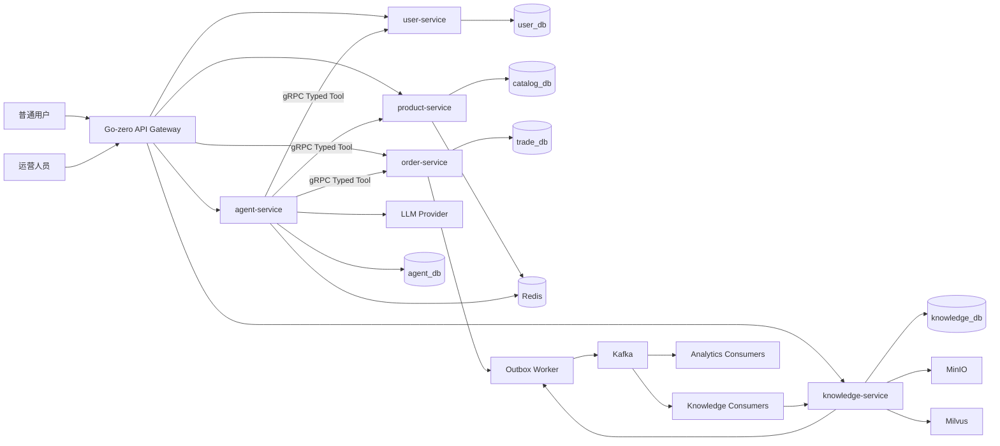
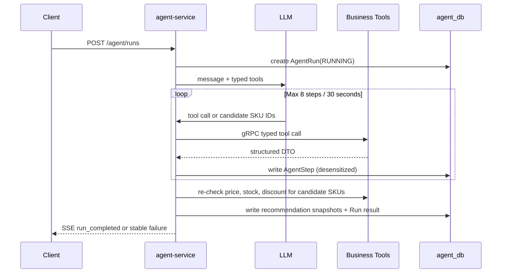
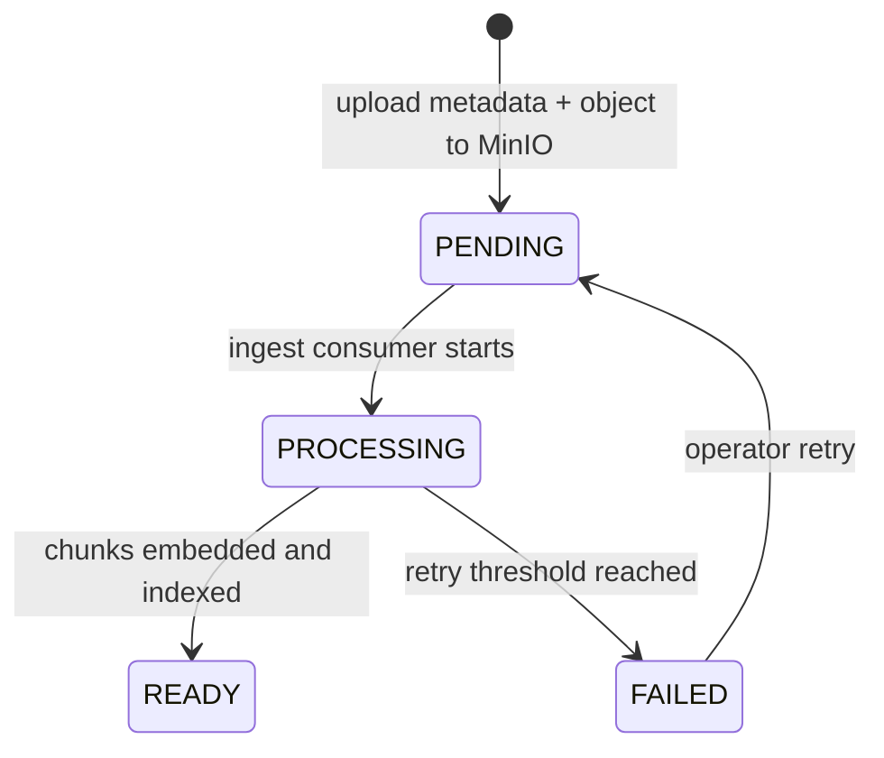

# 智选购 MVP 架构说明

## 1. 架构目标与原则

本文将 [PRD.md](PRD.md) 的产品需求落到服务、数据和事件边界。完整的数据库草案、API 草案和原型见 [智选购 AI 导购 MVP 设计文档](智选购-ai导购-mvp-design.md)。

架构遵循以下不可变约束：

1. Go-zero API Gateway 对外提供 HTTP/SSE，服务间只用 gRPC DTO 通信。
2. 服务拥有自己的 schema 与数据访问层；任何跨服务访问都不能直连对方数据库。
3. LLM 只能通过 `agent-service` 的 Typed Tool 读取受控业务数据，绝不直接进入数据库或交易写入路径。
4. MySQL 是交易和推荐快照的最终事实源；Redis 只缓存读数据与短期状态。
5. Kafka 只服务可重放的异步事件，配套 Outbox、消费幂等、retry topic 和 dead-letter topic，不承担缓存删除或通用延迟任务。

## 2. 逻辑拓扑



MVP 可以把五个逻辑 schema 部署在同一 MySQL 实例，但物理同实例不改变数据所有权：`user_db`、`catalog_db`、`trade_db`、`agent_db`、`knowledge_db` 分别只由对应服务访问。

## 3. 服务职责与接口边界

| 服务 | 拥有资源 | 同步对外能力 | 禁止事项 |
| --- | --- | --- | --- |
| `user-service` | 用户、画像、地址、钱包查询视图 | 鉴权、当前用户画像/地址/余额查询 | 访问其他用户数据或直接修改订单 |
| `product-service` | 分类、SPU、SKU、库存、优惠、商品缓存 | 商品检索、SKU 实时价格库存、可用优惠 | 让 Redis 成为库存事实源 |
| `order-service` | 购物车、订单、订单项、钱包流水、评价、交易 Outbox | 创建订单、余额支付、订单查询、评价 | 跨服务修改商品或用户表 |
| `knowledge-service` | 文档、Chunk、Embedding 任务、向量索引 | 上传资料、查询状态、商品知识检索 | 同步等待解析或 Embedding 完成 |
| `agent-service` | 会话、消息、Run/Step、推荐快照 | 运行 Agent、SSE 事件、Run 回放 | 直接改库存、余额、订单、优惠或执行 SQL |

`agent-service` 只能调用下列只读 Typed Tool。每个 Tool 必须声明 JSON Schema、最大返回数量、超时、授权来源和结构化输出 DTO：

| Tool | 调用服务 | 作用 | 关键约束 |
| --- | --- | --- | --- |
| `search_products` | `product-service` | 根据品类、预算、用途候选检索 | 只返回候选 SKU 与结构化属性，限制返回数量 |
| `get_user_profile` | `user-service` | 获取当前用户偏好和预算 | `user_id` 从 JWT 上下文注入，模型不可传入 |
| `get_price_stock` | `product-service` | 获取 SKU 实时价格、库存状态与可售状态 | 最终推荐前必须再次调用 |
| `get_discount` | `product-service` | 查询当前用户可用优惠 | 服务端从 JWT 绑定用户身份 |
| `search_product_knowledge` | `knowledge-service` | 查询商品资料和来源 | 仅检索当前 `READY` 版本 |

## 4. 关键同步链路

### 4.1 AI 导购与推荐校验



模型输出只接受 `sku_id`、`rank_no` 和 `reason`。推荐保存前，`agent-service` 使用业务 Tool 重新校验 SKU 存在、上架状态、当前价格、可售库存和优惠资格；失败候选直接过滤并记录校验结果。这样模型的语言生成不进入订单事实数据。

### 4.2 创建订单与余额支付

创建订单不扣库存。`order-service` 用 `(user_id, request_id)` 唯一约束实现幂等，并在订单项中保存商品、规格、价格与地址快照，初始状态为 `PENDING_PAYMENT`。

余额支付使用库存预留 Saga，不能让 `order-service` 写 `catalog_db.inventory`，也不引入分布式 transaction：

1. `order-service` 在 `trade_db` transaction 中将订单从 `PENDING_PAYMENT` 原子认领为 `PAYMENT_PROCESSING`，同时持久化唯一的 `payment_attempt_id` 与 `reservation_id`。
2. `product-service` 在自己的 `catalog_db` transaction 中对全部 SKU 执行条件扣减并写入 `inventory_reservations`；任一 SKU 库存不足则整个预留回滚。`reservation_id + sku_id` 是幂等键。
3. `order-service` 在独立的 `trade_db` transaction 中锁定该支付尝试；仅订单总额大于零时锁定钱包、校验余额并写 `wallet_ledger`。全额优惠的零金额订单跳过钱包读取、余额更新和流水，但仍在同一 transaction 写订单 `PAID` 和 `inventory.reservation.confirm` Outbox。该 transaction 不包含库存表。
4. product-side consumer 幂等确认预留。确认投递失败只会延迟确认，由 Outbox 重试；已支付订单绝不因消息延迟而释放库存。
5. 预留过期 worker 向 `order-service` 查询对应 `payment_attempt_id` 的结算状态：`PAID` 则确认，其他终态则释放。依赖超时必须保留预留并退避重试，禁止盲目释放。

库存条件更新仍只在 `product-service` 内执行：

```sql
UPDATE inventory
SET available_qty = available_qty - ?, version = version + 1, updated_at = NOW(3)
WHERE sku_id = ? AND available_qty >= ?;
```

`wallet_ledger` 的 `UNIQUE(biz_type, biz_id, direction)` 兜底扣款幂等；支付请求发现 `PAID` 时返回首次结果，发现匹配的 `PAYMENT_PROCESSING` 时返回稳定的 `PAYMENT_IN_PROGRESS`。恢复 worker 使用持久化的尝试和预留 ID，而非请求内存状态。

### 4.3 商品缓存

商品详情采用 Cache Aside：读取时缓存未命中才查询 `product-service` 的 MySQL 数据并回填 Redis。写商品、SKU、优惠或库存相关展示字段时，在本地 transaction 提交后立即删除对应缓存键，同时写入 `cache_invalidation_tasks` 的延迟二次删除任务。

延迟任务由 Go scheduler 扫描执行，不在请求 Goroutine 中等待。删除失败更新重试次数和下次执行时间；达到重试上限进入 `DEAD` 并告警。该机制只缩小并发读写时旧值被回填的窗口，库存扣减与支付判断始终以 MySQL 查询/条件更新为准。

## 5. RAG 与 Kafka 事件链

### 5.1 知识库状态机



上传只写原文件与文档元数据，随后事件链为：

```text
knowledge.document.ingest
-> parse / normalize / chunk
-> knowledge.chunk.embed
-> embedding / Milvus upsert
-> document READY
```

新版本资料必须先完整达到 `READY`，才切换为检索可见版本。检索过滤 `product_id`、`doc_type`、`version` 和 `READY` 状态；旧 Chunk 可留作审计，但不得参与正常召回。

### 5.2 Topic 合约

| Topic | 生产者 | Key | 必填载荷 | 消费语义 |
| --- | --- | --- | --- | --- |
| `knowledge.document.ingest` | `knowledge-service` | `document_id` | `event_id`、`document_id`、`product_id`、`version`、`object_key` | 解析与切分；按事件 ID 去重 |
| `knowledge.chunk.embed` | knowledge ingest consumer | `document_id:version` | `event_id`、`document_id`、`chunk_id`、`content_hash`、`embedding_model` | 向量写入；同一 chunk 不重复入库 |
| `behavior.events` | Gateway / domain services | `user_id` | `event_id`、`user_id`、`event_type`、`occurred_at`、`payload` | 行为统计；按用户维度保序 |
| `review.events` | `order-service` | `product_id` | `event_id`、`review_id`、`product_id`、`rating` | 评价分析；按商品维度保序 |

所有需要可靠投递的事件都先在产生方本地 transaction 写入 `outbox_events`，再由 Worker 发布。消费者使用 `event_consumptions(event_id, consumer_group)` 唯一约束记录处理结果。失败消息进入同语义 retry topic，并用 `next_retry_at` 实施退避；超过阈值后进入 dead-letter topic，保留原始事件与失败原因以支持人工重放。

## 6. 数据与一致性边界

| 数据 | 事实源 | 读模型/缓存 | 一致性方式 |
| --- | --- | --- | --- |
| 商品、SKU、库存、优惠 | `catalog_db` MySQL | Redis 商品详情 | 写提交后删缓存 + 持久化延迟二删；库存以条件更新为准 |
| 购物车、订单、钱包流水 | `trade_db` MySQL | 无交易事实缓存 | 本地 transaction、业务唯一约束、订单与商品快照 |
| 推荐与 Agent 审计 | `agent_db` MySQL | Redis 会话短状态 | Tool 二次校验后写不可变推荐快照 |
| 文档与版本 | `knowledge_db` MySQL + MinIO | Milvus 向量索引 | 版本状态切换、事件幂等、Chunk 唯一约束 |
| 行为/评价分析 | Kafka 事件与分析存储 | 运营查询视图 | Outbox、消费幂等、retry/dead-letter |

跨服务关系只传递 ID 和不可变快照。跨 schema 禁止建立物理外键，避免数据库层面把服务重新耦合；同服务内的强一致关系可建外键或用 transaction 保证。

## 7. 可观测性、错误与安全

### 7.1 可观测性

- Gateway 为每个请求生成或透传 `trace_id`，通过 HTTP、gRPC、Kafka Header 与日志上下文传递。
- `AgentRun` 是一次导购的主记录，`AgentStep` 记录模型轮次与 Tool 执行，状态仅能为 `RUNNING`、`SUCCEEDED`、`FAILED`、`TIMEOUT`。
- 每个外部调用（gRPC、Redis、Kafka、Milvus、MinIO、LLM）均使用 `context.Context` 和明确超时；日志记录依赖名称、操作、耗时、错误分类和 `trace_id`。
- 用户可见错误固定分为参数错误、未授权、资源不存在、库存不足、幂等冲突、依赖超时和内部错误；原始模型或 Provider 报文仅用于受限诊断。

### 7.2 安全与隐私

- JWT、密码 Hash、数据库/MinIO/Kafka 凭证和模型 API Key 仅来自环境变量或秘密管理。
- 地址、手机号、支付信息、Agent 输入输出和 Tool 参数在持久化与日志前执行字段级脱敏。
- Tool 的用户身份从认证上下文注入，不接受模型声称的用户 ID；Agent 没有交易写入 Tool。
- SQL 仅可通过参数化接口执行；模型文本、筛选条件和排序字段不能直接拼接到 SQL。

## 8. 本地部署与演进限制

Docker Compose 负责启动 Go 服务、MySQL、Redis、Kafka、Milvus、MinIO 与必要 Worker。所有依赖连接超时、Topic 名称、模型配置和凭证必须配置化，真实值不提交。

MVP 不引入分布式事务、共享数据库 DAO、多 Agent、Redis 预扣库存或真实支付渠道。若未来扩展，需要先更新设计文档，并验证不破坏上述数据所有权和交易不变量。
