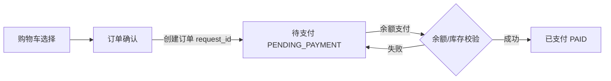

# 智选购 MVP 交互说明

## 1. 文档定位

本文规定 MVP 的信息架构、关键页面状态和异常反馈，供前后端共同实现和验收。功能范围见 [PRD.md](PRD.md)，服务和数据边界见 [architecture.md](architecture.md)，完整参考图见 [视频界面参考](assets/video-reference-contact-sheet.jpg)。

界面沿用视频中“用户商城 + AI 导购 + 运营工作台”的信息层级：用户端以快速选购为主，运营端以状态扫描和问题排查为主。页面不是营销落地页，不使用大面积说明性文案替代可操作内容。

## 2. 交互总原则

1. **业务数据优先**：价格、库存、优惠以业务返回的快照字段显示；AI 理由单独标注，不能伪装为交易字段。
2. **过程可见但不过载**：Agent 运行时展示简短进度；默认不展示底层 Prompt 或原始 Tool 输出，运营端在授权后查看脱敏详情。
3. **状态可恢复**：网络失败、模型失败、知识库处理中和支付失败均给出下一步动作，用户输入和已选商品不丢失。
4. **交易显式确认**：创建订单与余额支付分两步，支付前展示订单快照和应付金额；支付请求使用 `request_id` 防重复。
5. **权限最小化**：用户只看自己的记录；运营页面与用户商城明确分入口和角色。

## 3. 信息架构

```text
用户端
├─ 首页 / 商品列表
│  ├─ 分类与关键字筛选
│  └─ 商品详情
│     ├─ SKU 选择、价格库存、优惠
│     ├─ 商品知识问答
│     └─ 加入购物车 / 立即购买
├─ AI 导购
│  ├─ 会话列表
│  ├─ 对话与 Agent 进度
│  └─ 推荐结果与商品跳转
├─ 购物车
├─ 订单
│  ├─ 订单确认
│  ├─ 余额支付
│  └─ 订单详情 / 评价
└─ 我的资料

运营端
├─ 商品资料
│  ├─ 上传资料
│  └─ 文档版本与处理状态
├─ Agent 运行记录
│  ├─ Run 列表
│  └─ Step 时间线详情
└─ 基础事件概览
```

## 4. 用户端页面与状态

### 4.1 首页与商品列表

页面包含顶栏导航、搜索输入、分类筛选和商品网格。商品卡片固定展示图片、标题、最低可售价格、关键规格、库存状态和进入详情操作；无库存商品可查看详情但不能直接加入购物车。

| 状态 | 用户看到的内容 | 可用操作 | 数据要求 |
| --- | --- | --- | --- |
| 加载中 | 固定尺寸卡片骨架 | 保留筛选条件 | 防止内容加载造成布局跳动 |
| 正常 | 商品卡片与分页信息 | 筛选、搜索、进入详情、进入 AI 导购 | 只返回已上架商品 |
| 空结果 | 当前筛选条件下无商品 | 清空筛选、改用 AI 导购 | 不展示伪造推荐 |
| 依赖失败 | 简短“商品暂时无法加载”提示 | 重试 | 不泄露数据库或缓存异常细节 |

搜索框应同时接受关键词和自然语言入口。自然语言输入进入 AI 导购页并带入初始消息，普通关键词仍使用商品检索，不强制调用模型。

### 4.2 AI 导购页

桌面端采用左侧对话、右侧推荐结果的双栏结构；窄屏时先显示对话，推荐结果作为同页下方区域。会话头部显示标题、Run 状态和重新开始图标操作，避免用大量文字解释系统功能。

```text
┌──────────────────────────────┬────────────────────────────────┐
│ 会话消息与运行状态            │ 后端校验后的推荐 SKU            │
│ 用户需求                      │ 图片 / 标题 / 价格快照           │
│ Agent 回复                    │ 库存状态 / 优惠 / 推荐理由        │
│ 当前步骤：正在查询商品         │ [查看详情] [加入购物车]           │
├──────────────────────────────┴────────────────────────────────┤
│ 输入购买需求                                            [发送] │
└────────────────────────────────────────────────────────────────┘
```

一次消息提交后创建 `AgentRun` 并订阅 SSE。前端按下表渲染事件，不自行推断最终状态：

| SSE 事件 | 页面变化 | 允许操作 |
| --- | --- | --- |
| `run_started` | 新增用户消息和“正在理解需求”状态 | 禁止重复发送当前消息，可离开页面后再返回 |
| `step_started` | 展示简短阶段，如“正在筛选商品” | 不展示原始 Tool 参数 |
| `tool_result` | 更新进度或候选数摘要 | 继续等待最终校验 |
| `step_failed` | 显示可行动短提示 | 重试本次需求或修改条件 |
| `run_completed` | 显示解释性回复和推荐卡片 | 查看详情、加入购物车、继续追问 |

推荐卡片的字段来源必须视觉分层：

- AI 层：推荐理由、满足的预算/用途/偏好。
- 业务层：SKU 规格、价格快照、库存状态、优惠快照、校验时间。
- 操作层：查看商品详情、加入购物车。

卡片不展示“模型给出的价格”；业务数据缺失、SKU 下架或库存不足时，卡片从最终结果移除并在回复中以聚合原因说明。

#### 导购失败与降级

| 场景 | 用户提示 | 保留内容 | 下一步 |
| --- | --- | --- | --- |
| LLM/Tool 超时 | “导购服务响应超时，请稍后重试。” | 原始需求与已有会话 | 重试 |
| 无匹配商品 | “当前条件下没有可售商品，可放宽预算或品类。” | 已输入条件 | 修改条件 |
| 推荐二次校验失败 | “候选商品状态已变化，已为你过滤不可售结果。” | 其余有效推荐 | 查看有效商品或继续提问 |
| 会话加载失败 | “会话暂时无法加载。” | 本地草稿 | 重试或新建会话 |

### 4.3 商品详情与知识问答

商品详情顶部固定 SKU 选择、当前价格、库存状态、优惠信息、数量控制和购买操作。下方使用 Tabs 展示商品详情、参数规格、售后规则和商品问答。

SKU 切换必须触发价格、库存和优惠重查；切换期间购买按钮不可提交，避免用上一 SKU 的价格或库存创建意图。库存不足时“加入购物车”和“立即购买”禁用，并保留可查看的售后与问答入口。

商品问答区由问题输入、回答区和来源标记组成：

| 回答状态 | 展示内容 | 行为 |
| --- | --- | --- |
| 检索中 | 问题仍保留，显示短加载状态 | 同一问题不可重复提交 |
| 有依据 | 回答、文档类型、版本、章节/页码 | 可继续提问 |
| 无依据 | “资料中没有足够信息回答该问题。” | 建议查看规格或售后 Tab |
| RAG 不可用 | 基于结构化字段/规则的受控回答，明确资料检索暂不可用 | 可重试 |

价格、库存、订单和优惠类问题不在回答中生成猜测值，应显示来自对应业务查询的当前结果，或引导用户查看商品信息。

### 4.4 购物车、订单确认与支付

购物车按用户隔离，商品行包含 SKU 规格、当前展示价格、数量、选择状态和失效提示。进入订单确认页时重新校验商品可售状态、地址和优惠资格，并生成新的订单快照；购物车展示值不是支付依据。



支付按钮在请求发出后进入提交中状态，直至拿到订单结果；前端不会因网络超时改写支付结果，而是查询订单状态。支付页面必须展示：订单号、商品与规格快照、收货地址快照、优惠快照、应付金额、余额和支付状态。

| 结果 | 界面状态 | 用户动作 |
| --- | --- | --- |
| 创建成功 | 显示待支付订单 | 余额支付或返回订单列表 |
| 库存不足 | 保留待支付订单并提示商品库存变化 | 返回购物车修改数量或刷新商品 |
| 余额不足 | 保留待支付订单 | 返回账户页面或取消订单 |
| 重复请求/网络超时 | 查询并展示首次订单或支付结果 | 不允许再次盲目提交 |
| 支付成功 | 显示已支付订单和余额结果 | 查看订单、完成后评价 |

### 4.5 订单与评价

订单列表按 `PENDING_PAYMENT`、`PAID`、`COMPLETED`、`CLOSED` 筛选。订单详情只使用订单快照，不依赖当前商品页回填。评价入口只对已完成订单项显示，成功提交后更新本地状态，分析结果异步处理，不阻塞用户完成评价。

## 5. 运营端页面与状态

### 5.1 商品资料与知识库

资料页采用列表主视图与右侧详情抽屉。上传区选择关联商品和资料类型（DETAIL、SPEC、FAQ、AFTER_SALE），文件上传成功即显示版本和 `PENDING` 状态；不等待解析或 Embedding。

已实现的前端入口为 `#/ops/documents`，对应 Gateway ops API：`GET/POST /api/v1/ops/knowledge/documents`、`GET /api/v1/ops/knowledge/documents/{document_no}`、`POST /api/v1/ops/knowledge/documents/{document_no}/retry`。所有 ops 调用必须由 ops client 发送 `X-AI-Shopping-Operator: true`，用户商城页面不能发送该 header。

| 文档状态 | 列表标记 | 详情信息 | 可用操作 |
| --- | --- | --- | --- |
| `PENDING` | 等待处理 | 文件、版本、上传时间 | 查看 |
| `PROCESSING` | 正在处理 | 当前阶段、已完成 Chunk 数 | 刷新 |
| `READY` | 可检索 | Chunk 数、Embedding 模型、完成时间 | 查看来源信息 |
| `FAILED` | 处理失败 | 稳定错误分类与最近失败时间 | 重试 |

上传新版本时，旧版本继续标记为当前可用，直至新版本 `READY`；界面不能在新版本处理中误提示资料已生效。

### 5.2 Agent Run 时间线

左侧为可按状态、用户、时间筛选的 Run 列表，右侧为单 Run 详情。详情头展示 `run_id`、状态、模型版本、开始结束时间、总耗时和 `trace_id`；时间线按 `step_no` 排序。

已实现的前端入口为 `#/ops/agent-runs`，对应 `GET /api/v1/ops/agent-runs` 与 `GET /api/v1/ops/agent-runs/{run_id}`。事件概览入口为 `#/ops/events`，对应 `GET /api/v1/ops/events/overview`，只读展示 `behavior.events`、`review.events`、商品评分统计和 analytics dead-letter。

```text
┌─────────────────┬──────────────────────────────────────────────┐
│ Run 列表         │ run_001   SUCCEEDED   trace_id                │
│ run_001  成功    │ 01 模型决策        320ms        成功           │
│ run_002  超时    │ 02 search_products  45ms        成功           │
│ run_003  失败    │ 03 get_price_stock  26ms        成功           │
│                  │ 04 推荐校验         18ms        成功           │
│                  │ 最终推荐与业务快照                              │
└─────────────────┴──────────────────────────────────────────────┘
```

点击 Step 后显示 Tool 名称、脱敏输入输出、尝试次数、耗时和错误分类。原始 Token、密钥、手机号、地址和模型内部报文不进入页面。失败 Step 的呈现应明确是模型、Tool、依赖超时还是业务校验失败，避免笼统显示“系统错误”。

## 6. 空状态、反馈与可访问性

- 图标按钮必须有 tooltip 或可访问名称；删除、重试、支付等操作有明确状态反馈。
- 加载、空结果、无权限、依赖失败和已失效商品均有独立状态，不能以空白区域表达失败。
- 表单字段提供输入校验和可读错误；订单地址、金额、库存状态与支付状态使用文本而非仅颜色区分。
- 长商品标题、优惠说明和错误消息允许换行，不挤压固定尺寸的商品卡片、订单金额和操作区域。
- 移动端优先保证导购输入、推荐卡片、SKU 选择和支付确认可单列操作；运营时间线可改为列表到详情的单页跳转。

## 7. 交互验收清单

1. 用户可从自然语言搜索直接进入带初始消息的 AI 导购页。
2. 推荐卡片清楚区分 AI 理由和后端业务快照，并提供商品详情与购物车操作。
3. Agent 执行期间可见阶段进度；失败后能保留用户需求并重试。
4. SKU 切换、订单确认和支付均重新查询必要业务数据，支付不会因重复点击造成重复扣款。
5. 商品问答的资料答案显示来源；找不到资料时不伪造答案。
6. 运营端可区分资料新旧版本、失败状态和 Run/Step 的错误类型。
