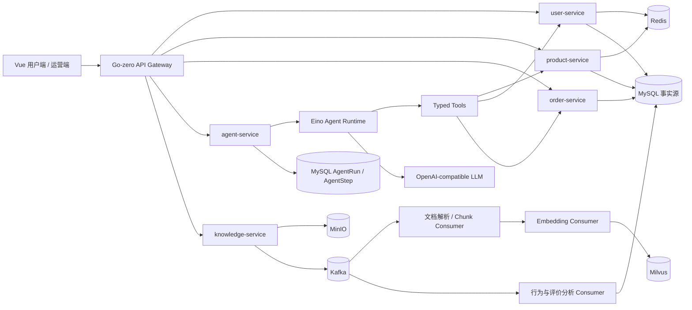
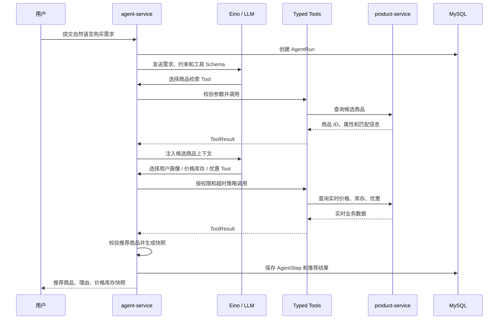

# 智选购 AI 导购 MVP 设计文档

## 1. 文档信息

- 项目名称：智选购（AI 购）
- 版本：MVP v0.1
- 目标：用 Go 重建一条可运行、可解释、可面试追问的 AI 导购主链路
- 参考原型：视频中的用户商城、商品详情问答、商品知识库、Agent 执行记录页面
- 预计周期：个人开发 4-6 周，每天 3-4 小时
- 当前状态：M1-M3 与 M4.1 已实现；M4.2-M6 待实现

本 MVP 不是原项目全部功能的等价复制，而是围绕 AI 导购完成最小业务闭环：

```text
自然语言购买需求
  -> Agent 识别约束并调用业务 Tools
  -> 后端用真实价格、库存和优惠二次校验
  -> 输出可解释推荐
  -> 加入购物车并创建订单
  -> 评价和行为事件进入 Kafka
```

## 2. 设计目标

### 2.1 必须达成

1. 用户能用自然语言提出购买需求，并获得至少 3 个可解释的商品推荐。
2. Agent 能调用商品检索、用户画像、价格库存、优惠查询四类 Tools。
3. 推荐结果中的价格、库存和优惠来自业务服务，不由模型直接写入。
4. 管理端可以查看一次 Agent Run 的完整 Step、耗时和错误。
5. 用户可以从推荐结果进入购物车、创建订单并完成余额支付。
6. 商品资料可以异步进入 RAG 知识库，商品问答能返回检索到的上下文。

### 2.2 明确不做

- 完整管理员 CRUD 和复杂营销后台
- 多模型在线编排、模型计费和租户管理
- 秒杀级 Redis 预扣库存
- 复杂优惠券规则、退款和真实第三方支付
- 全量经营报表和推荐算法训练
- 多 Agent 协作

## 3. 用户与核心场景

### 3.1 普通用户

- 浏览商品和商品详情
- 在 AI 导购中表达预算、品类、用途、偏好等约束
- 查看推荐理由、价格、库存和优惠快照
- 追问商品参数、售后规则和使用场景
- 将推荐商品加入购物车并余额支付
- 对已完成订单进行评价

### 3.2 运营人员

- 上传商品详情、FAQ 和售后规则资料
- 查看资料处理状态和知识库版本
- 查看 AgentRun / AgentStep 执行时间线
- 查看推荐记录、评价分析和基础行为统计

## 4. 技术选型

| 层次 | 选型 | 选择理由 |
| --- | --- | --- |
| API / RPC | Go-zero（API Gateway / gRPC RPC） | 统一 API、RPC、配置和服务边界，适合 Go 微服务 MVP |
| Agent | Eino | 提供 Go 原生 ChatModel、Tool、Embedding 和 Agent 编排能力 |
| 关系数据 | MySQL | 用户、商品、订单、库存、余额流水和执行记录的事实源 |
| 缓存 | Redis | 商品详情、会话和短期 Agent 状态的热点缓存 |
| 事件流 | Kafka | 知识库分阶段处理、行为事件和运营分析的异步解耦与重放 |
| 向量检索 | Milvus | 支持 Embedding 相似度检索和商品/文档版本元数据过滤 |
| 文件存储 | MinIO | 保存商品资料原文件，避免大文本直接进入业务表 |
| 部署 | Docker Compose | 一键启动 Go 服务、MySQL、Redis、Kafka、Milvus 和 MinIO |

Kafka 只用于跨模块事件与可重放异步流程。缓存失效不依赖 Kafka，而是采用 MySQL 事实源、提交后删除 Redis、延迟二次删除和持久化重试任务。

## 5. 总体架构



## 6. 服务边界

### 6.1 user-service

负责注册登录、JWT、用户画像、收货地址和余额账户查询。Agent 只能通过当前用户身份读取自己的画像、收藏和订单摘要。

### 6.2 product-service

负责分类、商品详情、规格、价格、库存、优惠摘要和商品搜索。商品详情读路径使用 Cache Aside；库存扣减不信任缓存。

### 6.3 order-service

负责购物车、订单、余额支付和评价。订单创建使用 `request_id` 幂等；余额扣款、订单状态和 Outbox 在 `trade_db` 本地 transaction 中完成，库存预留与确认只经由 product-service 的受控 gRPC 完成。

### 6.4 knowledge-service

负责资料上传、文档版本、处理状态、Chunk 元数据和 Milvus 检索。上传接口只完成文件保存和任务登记，解析与向量化异步执行。

### 6.5 agent-service

负责会话、Agent Run、Step、Tool 白名单、模型调用、推荐快照和 SSE 进度推送。不直接修改库存、余额和订单状态。

## 7. Agent 导购流程



### 7.1 Tool 清单

| Tool | 输入 | 输出 | 约束 |
| --- | --- | --- | --- |
| `search_products` | 关键词、分类、预算、属性 | 候选商品 ID 和匹配字段 | 只读，限制返回数量 |
| `get_user_profile` | 当前用户 ID | 收藏、订单摘要、偏好标签 | 强制绑定登录用户 |
| `get_price_stock` | 商品 ID 列表 | 实时价格、库存、可售状态 | 不接受模型提供的价格 |
| `get_discount` | 用户 ID、商品 ID | 当前可用优惠 | 服务端校验用户资格 |
| `search_product_knowledge` | 商品 ID、问题、资料类型 | RAG snippet 或受控 fallback reason | 只检索当前 READY 版本 |

### 7.2 Agent 防护边界

- 最大 8 个 Step，单次 Run 超时 30 秒。
- Tool 只允许白名单调用，模型不能直接执行 SQL 或写订单。
- Tool 入参使用 JSON Schema 校验，失败返回结构化错误。
- 商品推荐只接受商品 ID 和理由，价格、库存、优惠由后端重新查询。
- 模型原始错误不直接返回用户，转为简短的可行动提示。

## 8. RAG 知识库流程

```text
上传商品资料
  -> MinIO 保存原文件
  -> MySQL 写入 document(version, status)
  -> Kafka knowledge.document.ingest
  -> parser consumer 提取文本并切分 chunks
  -> Kafka knowledge.chunk.embed
  -> embedding consumer 生成向量
  -> Milvus 写入 vector + product_id + document_version
  -> MySQL 更新 document.status = READY
```

### 8.1 Chunk 规则

- 默认按标题、段落和列表边界切分，避免把规格表拆散。
- 每个 Chunk 保存 `product_id`、`document_id`、`version`、`section` 和来源页码。
- 查询时按商品、文档版本和可见状态过滤，避免召回旧版本资料。
- 同一 `document_id + version + chunk_index` 作为幂等键。

### 8.2 Kafka 主题

| Topic | Key | 消费者 | 失败处理 |
| --- | --- | --- | --- |
| `knowledge.document.ingest` | `document_id` | parser consumer | retry topic / dead-letter topic |
| `knowledge.chunk.embed` | `document_id:version` | embedding consumer | retry topic / dead-letter topic |
| `behavior.events` | `user_id` | analytics consumer | 幂等表 + 重试 |
| `review.events` | `product_id` | review-analysis consumer | 幂等表 + 重试 |

Kafka 消费按业务事件 ID 幂等；需要重建向量或统计时可以重放原始事件。

## 9. 核心数据模型

### 9.1 设计约定

- 业务主键使用 `BIGINT UNSIGNED`，对外暴露 `order_no`、`run_id` 等不可枚举的 ULID/UUID 字符串。
- 金额统一使用 `DECIMAL(12,2)`，禁止使用浮点数；时间统一使用 UTC `DATETIME(3)`。
- 所有业务表包含 `created_at`、`updated_at`；软删除字段只用于商品、资料等可恢复资源。
- 商品采用 SPU/SKU 两级模型：商品标题和详情属于 SPU，价格、规格和库存属于 SKU。
- JSON 字段只保存可演进的快照或模型输入输出，不用于高频过滤条件。
- MVP 在同一个 MySQL 实例中部署 `user_db`、`catalog_db`、`trade_db`、`agent_db`、`knowledge_db` 五个逻辑 schema；服务拥有自己的表。
- 表中标记的 `FK` 优先表示逻辑关联。仅同一服务内创建物理外键；跨服务只保存对方 ID 和不可变快照，通过 gRPC 查询，避免跨服务数据库耦合。

### 9.2 用户与商品目录

```text
users(
  id PK, email UNIQUE, password_hash, status, created_at, updated_at
)
user_profiles(
  user_id PK/FK users.id, preference_json, budget_min, budget_max,
  profile_version, updated_at
)
user_addresses(
  id PK, user_id FK, receiver_name, receiver_phone, province, city,
  district, detail, is_default, created_at, updated_at
)
categories(
  id PK, parent_id, name, status, sort_no, created_at, updated_at
)
brands(
  id PK, name UNIQUE, status, created_at, updated_at
)
products(
  id PK, category_id FK, brand_id FK, title, subtitle, detail_markdown,
  status, version, created_at, updated_at, deleted_at
)
product_skus(
  id PK, product_id FK, sku_code UNIQUE, spec_json,
  sale_price DECIMAL(12,2), status, created_at, updated_at
)
product_images(
  id PK, product_id FK, object_key, sort_no, created_at
)
promotion_rules(
  id PK, product_id FK, rule_type, threshold_amount DECIMAL(12,2),
  discount_amount DECIMAL(12,2), start_at, end_at, status,
  created_at, updated_at
)
user_coupons(
  id PK, user_id FK, promotion_id FK, status, claimed_at, used_order_no,
  expired_at, updated_at,
  UNIQUE(user_id, promotion_id)
)
inventory(
  sku_id PK/FK product_skus.id, available_qty,
  version, updated_at
)
inventory_reservations(
  id PK, reservation_id, order_no, payment_attempt_id, sku_id, quantity,
  status, expires_at, confirmed_at, released_at, created_at, updated_at,
  UNIQUE(reservation_id, sku_id)
)
```

关键索引：

- `products(category_id, status, created_at)`：分类分页。
- `products(brand_id, status, created_at)`：品牌筛选。
- `product_skus(product_id, status)`：商品规格查询。
- `inventory(sku_id)`：库存条件更新；库存不放在 Redis 中作为事实源。
- `user_addresses(user_id, is_default)`：默认收货地址查询。
- `promotion_rules(product_id, status, start_at, end_at)`：可用优惠筛选。
- `user_coupons(user_id, status, expired_at)`：用户可用优惠查询。

### 9.3 购物车、订单与钱包

```text
carts(
  id PK, user_id UNIQUE, created_at, updated_at
)
cart_items(
  id PK, cart_id FK, sku_id FK, quantity, selected,
  UNIQUE(cart_id, sku_id)
)
orders(
  id PK, order_no UNIQUE, user_id FK, request_id,
  status, payment_attempt_id, reservation_id, payment_started_at,
  total_amount DECIMAL(12,2), paid_amount DECIMAL(12,2),
  shipping_name_snapshot, shipping_phone_snapshot, shipping_address_snapshot,
  created_at, paid_at, closed_at, updated_at,
  UNIQUE(user_id, request_id)
)
order_items(
  id PK, order_id FK, sku_id FK, product_title_snapshot,
  sku_spec_snapshot, unit_price DECIMAL(12,2), quantity,
  item_amount DECIMAL(12,2), created_at
)
wallet_accounts(
  user_id PK/FK users.id, balance DECIMAL(12,2), version,
  created_at, updated_at
)
wallet_ledger(
  id PK, user_id FK, order_no, biz_type, biz_id,
  direction, amount DECIMAL(12,2), balance_after DECIMAL(12,2),
  UNIQUE(biz_type, biz_id, direction), created_at
)
reviews(
  id PK, order_item_id FK, order_id FK, product_id FK, user_id FK,
  rating, content, status, created_at,
  UNIQUE(order_item_id, user_id)
)
```

订单支付使用库存预留 Saga。`inventory_reservations` 属于 `catalog_db/product-service`，表中的 `order_no` 与 `payment_attempt_id` 是逻辑关联，不创建跨 schema 外键。

1. 创建订单时校验用户、购物车、地址和 `request_id`，并写入商品、价格和地址快照，状态为 `PENDING_PAYMENT`。
2. 支付认领 transaction 将订单更新为 `PAYMENT_PROCESSING` 并保存不可复用的 `payment_attempt_id` 与 `reservation_id`。请求重复到达时，`PAID` 返回原结果，处理中返回 `PAYMENT_IN_PROGRESS`。
3. `product-service.ReserveStock` 在自己的 transaction 内对所有 SKU 执行库存条件更新并写 `RESERVED` 预留；任一 SKU 失败则整体 rollback。
4. `order-service` 仅在 `trade_db` transaction 内锁定钱包和支付尝试，写流水、订单 `PAID` 与 `inventory.reservation.confirm` Outbox。此 transaction 不访问库存表。
5. `product-service` 幂等消费确认事件，把预留置为 `CONFIRMED`。预留过期时先查询 order 的结算状态，`PAID` 则确认，未支付或已取消才置为 `RELEASED` 并返还库存；查询失败保留预留并退避。

库存扣减 SQL：

```sql
UPDATE inventory
SET available_qty = available_qty - ?, version = version + 1, updated_at = NOW(3)
WHERE sku_id = ? AND available_qty >= ?;
```

`request_id` 防止重复建单，`wallet_ledger` 的业务唯一键防止重复扣款，`reservation_id + sku_id` 防止重复预留；Redis 只用于读缓存和会话，不参与资金和库存事实判断。

### 9.4 Agent 会话、运行和推荐快照

```text
agent_sessions(
  id PK, session_no UNIQUE, user_id FK, title, status,
  created_at, updated_at
)
agent_messages(
  id PK, session_id FK, seq_no, role, content,
  model_name, prompt_version, token_usage_json, created_at,
  UNIQUE(session_id, seq_no)
)
agent_runs(
  id PK, run_id UNIQUE, session_id FK, user_id FK, trace_id UNIQUE,
  user_input, status, model_name, prompt_version, step_count,
  final_result_json, error_code, error_message,
  started_at, ended_at, created_at
)
agent_steps(
  id PK, run_id FK, step_no, step_type, tool_name, attempt,
  input_json, output_json, status, error_code, error_message,
  latency_ms, started_at, ended_at,
  UNIQUE(run_id, step_no, attempt)
)
recommendations(
  id PK, run_id FK, rank_no, sku_id FK, reason,
  price_snapshot DECIMAL(12,2), stock_snapshot,
  discount_snapshot_json, validation_status, created_at,
  UNIQUE(run_id, rank_no)
)
```

`AgentRun` 表示一次完整导购任务，`AgentStep` 表示其中一轮模型决策或 Tool 调用。M4.1 已实现 Agent 会话、Run、Step、受控 Tool 和 `StartRun` / `GetRun` gRPC；`recommendations` 属于 M4.2，推荐表只保存后端二次校验后的价格、库存和优惠快照，不能直接使用模型输出的交易字段。

关键索引：

- `agent_runs(user_id, created_at)`：用户历史记录。
- `agent_runs(session_id, created_at)`：会话内运行记录。
- `agent_steps(run_id, step_no)`：时间线回放。
- `recommendations(run_id, rank_no)`：推荐结果排序。

### 9.5 RAG 知识库

```text
knowledge_documents(
  id PK, document_no UNIQUE, product_id FK, doc_type, version,
  object_key, source_hash, file_type, embedding_model,
  status, chunk_count, error_code, error_message,
  created_at, processed_at, updated_at,
  UNIQUE(product_id, doc_type, version),
  UNIQUE(product_id, doc_type, source_hash)
)
knowledge_chunks(
  id PK, document_id FK, product_id FK, version, chunk_index,
  section, content, content_hash, source_page, vector_ref,
  status, created_at,
  UNIQUE(document_id, chunk_index),
  UNIQUE(document_id, content_hash)
)
embedding_tasks(
  id PK, event_id UNIQUE, document_id FK, version,
  status, retry_count, next_retry_at, last_error,
  created_at, updated_at
)
```

Milvus 中的向量记录必须携带 `chunk_id`、`product_id`、`document_id`、`version` 和 `status` 元数据；检索先做可见版本过滤，再按相似度排序。旧版本不物理删除时，也不能参与正常检索。

`doc_type` 取值为 `DETAIL`、`SPEC`、`FAQ`、`AFTER_SALE`，同一商品可以同时拥有多个资料类型；同一类型的新版资料只有在状态为 `READY` 后才切换为可见版本。

### 9.6 Outbox、消费幂等与缓存补偿

```text
outbox_events(
  id PK, event_id UNIQUE, aggregate_type, aggregate_id,
  topic, event_key, payload_json, status,
  retry_count, next_retry_at, last_error, created_at, published_at
)
event_consumptions(
  id PK, event_id, consumer_group, status, consumed_at,
  UNIQUE(event_id, consumer_group)
)
cache_invalidation_tasks(
  id PK, cache_key, execute_at, retry_count,
  status, last_error, created_at, executed_at
)
```

订单完成、评价提交等需要可靠发布的事件，先在本地 transaction 中写入 `outbox_events`，再由 Go Worker 投递 Kafka。消费者用 `event_consumptions` 实现幂等。商品信息更新后提交 transaction，立即删除 Redis 并创建 `cache_invalidation_tasks`；任务以 `(cache_key, execute_at)` 建索引，允许同一缓存键产生多次延迟删除，定时任务负责二次删除和失败重试。

### 9.7 关系与状态约束

```text
users 1--1 user_profiles
users 1--1 carts 1--N cart_items N--1 product_skus N--1 products
users 1--N orders 1--N order_items N--1 product_skus
users 1--1 wallet_accounts 1--N wallet_ledger
orders 1--N reviews
users 1--N agent_sessions 1--N agent_messages
agent_sessions 1--N agent_runs 1--N agent_steps
agent_runs 1--N recommendations N--1 product_skus
products 1--N knowledge_documents 1--N knowledge_chunks
```

核心状态：

- `orders`: `PENDING_PAYMENT -> PAYMENT_PROCESSING -> PAID -> COMPLETED`；支付认领失败或恢复判定未支付时回到 `PENDING_PAYMENT`，取消或超时进入 `CLOSED`。
- `inventory_reservations`: `RESERVED -> CONFIRMED / RELEASED`；只有结算状态查询失败时允许维持 `RESERVED` 并重试。
- `agent_runs`: `RUNNING -> SUCCEEDED / FAILED / TIMEOUT`。
- `knowledge_documents`: `PENDING -> PROCESSING -> READY / FAILED`。
- `outbox_events`: `PENDING -> PUBLISHED / DEAD`。
- `cache_invalidation_tasks`: `PENDING -> DONE / DEAD`。

### 9.8 高价值索引与数据保留

| 表 | 索引 / 约束 | 目的 |
| --- | --- | --- |
| `orders` | `(user_id, status, created_at)` | 用户订单分页和状态筛选 |
| `order_items` | `(order_id)` | 订单详情聚合 |
| `wallet_ledger` | `(user_id, created_at)` + `UNIQUE(biz_type, biz_id, direction)` | 余额流水查询与防重复扣款 |
| `inventory_reservations` | `(status, expires_at)` + `UNIQUE(reservation_id, sku_id)` | 过期扫描、幂等预留与确认 |
| `reviews` | `(product_id, status, created_at)` | 商品评价列表和 Kafka 事件补偿 |
| `agent_messages` | `(session_id, seq_no)` | 多轮会话顺序读取 |
| `agent_runs` | `(status, created_at)` | 扫描超时 Run 和运营端筛选 |
| `agent_steps` | `(run_id, step_no, attempt)` | Step 回放和重试定位 |
| `knowledge_documents` | `(product_id, doc_type, status, processed_at)` | 当前知识资料定位 |
| `knowledge_chunks` | `(document_id, status, chunk_index)` | 文档入库进度和补偿 |
| `outbox_events` | `(status, next_retry_at, created_at)` | Worker 扫描待投递事件 |
| `cache_invalidation_tasks` | `(status, execute_at)` + `(cache_key, execute_at)` | 延迟二删和失败重试扫描 |

数据保留策略：`agent_steps.input_json/output_json` 和 `agent_messages.content` 只保留脱敏后的内容，默认保留 90 天；订单、钱包流水和推荐快照不做物理删除；RAG 旧版本 Chunk 保留用于审计，但 Milvus 检索必须过滤为当前 `READY` 版本。

## 10. API 草案

### 10.1 创建 Agent Run

M4.1 已先提供 agent-service gRPC：`StartRun(StartRunRequest)` 和 `GetRun(GetRunRequest)`。Gateway HTTP、SSE 和可信推荐快照留到 M4.2/M5。

计划中的 Gateway HTTP：

`POST /api/v1/agent/runs`

```json
{
  "message": "预算 5000 元，想买一台适合编程和轻度游戏的笔记本",
  "session_id": "sess_001"
}
```

```json
{
  "run_id": "run_001",
  "status": "RUNNING",
  "stream_url": "/api/v1/agent/runs/run_001/events"
}
```

### 10.2 查询 Run 详情

`GET /api/v1/agent/runs/{run_id}`

返回 Run 状态、总耗时、推荐结果和 Step 摘要。执行过程中通过 SSE 推送 `step_started`、`tool_result`、`step_failed` 和 `run_completed` 事件。

### 10.3 商品问答

`POST /api/v1/products/{product_id}/qa`

```json
{
  "question": "这款电脑支持多大内存？"
}
```

商品知识问题走 Milvus 检索；价格、库存、订单和售后问题走确定性 Tool 或规则查询。

### 10.4 创建订单

`POST /api/v1/orders`

请求必须携带 `request_id`。服务端校验购物车和地址，写入订单、订单明细、商品价格和地址快照，初始状态为 `PENDING_PAYMENT`；重复请求返回首次创建结果。

### 10.5 余额支付

`POST /api/v1/orders/{order_no}/payments/wallet`

服务端先在 `trade_db` 认领 `PAYMENT_PROCESSING` 支付尝试，再调用 product-service 创建库存预留。扣款 transaction 只锁定订单与钱包、写入流水和 `inventory.reservation.confirm` Outbox；产品侧异步确认预留。重复支付返回已支付结果或 `PAYMENT_IN_PROGRESS`，订单服务不能直接更新 `catalog_db.inventory`。详见库存预留 Saga。

## 11. 原型与交互

原型沿用视频中的信息层级：用户端保持商城商品网格和商品详情入口，AI 导购以独立对话区承载；运营端采用左侧导航、列表页和抽屉/详情页，重点展示 Agent 执行时间线。


### 11.1 用户端首页

```text
┌─────────────────────────────────────────────────────────────┐
│ 智选购 Logo      首页  分类  我的订单  AI 导购               │
├─────────────────────────────────────────────────────────────┤
│              商品搜索 / “告诉我你想买什么”                  │
├─────────────────────────────────────────────────────────────┤
│  分类筛选       商品卡片       商品卡片       商品卡片        │
│                 图片 / 名称 / 价格 / 库存                    │
└─────────────────────────────────────────────────────────────┘
```

### 11.2 AI 导购页

```text
┌──────────────────────────────┬──────────────────────────────┐
│ 对话区                       │ 推荐结果                      │
│ 用户需求                     │ 商品卡片                      │
│ Agent 回复与推荐理由         │ 价格 / 库存 / 优惠快照         │
│ 输入框 + 发送                 │ 加入购物车 / 查看详情          │
└──────────────────────────────┴──────────────────────────────┘
```

### 11.3 商品详情页

```text
┌─────────────────────────────────────────────────────────────┐
│ 图片 / 名称 / 价格 / 库存 / 规格                             │
│ [加入购物车] [立即购买]                                      │
├─────────────────────────────────────────────────────────────┤
│ 商品详情        参数规格        售后规则                     │
├─────────────────────────────────────────────────────────────┤
│ AI 商品问答：输入问题 -> RAG / Tool -> 回答与来源             │
└─────────────────────────────────────────────────────────────┘
```

### 11.4 运营端 Agent 时间线

```text
┌──────────────┬──────────────────────────────────────────────┐
│ 运行记录列表  │ Run: run_001  状态: COMPLETED                 │
│ run_001       │ 01 search_products     420ms                 │
│ run_002       │ 02 get_user_profile    18ms                  │
│ run_003       │ 03 get_price_stock     26ms                  │
│               │ 04 get_discount        15ms                  │
│               │ 最终推荐：3 个商品                            │
└──────────────┴──────────────────────────────────────────────┘
```

### 11.5 视觉约束

- 用户端使用白底、低密度边框和橙红色主行动色，保留视频中商品商城的直接感。
- 运营端优先信息密度和扫描效率，不使用营销型大面积装饰。
- Agent Step 使用状态色区分运行中、成功、失败和超时；错误显示短摘要和下一步动作。
- 推荐卡片必须同时展示 AI 理由和后端价格/库存快照，避免把模型文本当作业务字段。

## 12. 错误与安全策略

- 身份认证：JWT；所有订单、地址、画像和收藏查询绑定当前用户 ID。
- Tool 权限：只读 Tool 与写入 Tool 分离，MVP Agent 只开放只读查询和推荐提交。
- 模型故障：区分认证失败、限流、超时、供应商错误和 Tool 错误，用户只看到简短可行动文案。
- RAG 故障：知识库不可用时降级为商品结构化字段问答，不编造知识库内容。
- Kafka 消费：业务事件 ID 幂等，失败进入 retry topic，超过次数进入 dead-letter topic。
- 订单幂等：`user_id + request_id` 唯一索引；钱包流水以 `order_id` 防止重复扣款。
- 日志脱敏：不记录 API Key、完整地址和敏感支付信息；Agent 输入和 Tool 输出按字段脱敏。

## 13. 验收标准

### 13.1 主链路

- 用户输入预算、用途和偏好后，30 秒内返回推荐或明确失败原因。
- 推荐结果至少包含商品 ID、理由、实时价格、库存状态和优惠快照。
- AgentRun 页面可以看到每个 Tool 的入参、出参、耗时和状态。
- 推荐商品可以加入购物车、创建订单并完成余额支付。
- 重复提交同一个 `request_id` 不重复建单、不重复扣款。

### 13.2 RAG 链路

- 上传商品资料后接口立即返回处理状态，不等待向量化完成。
- 文档处理失败可以看到错误并重试，不产生重复 chunk。
- 更新商品资料后旧版本 chunk 不再参与检索。
- 商品知识问答能够返回答案来源的商品和文档版本信息。

### 13.3 稳定性

- Tool 超时或模型失败时，Run 进入明确失败状态，不遗留 RUNNING 任务。
- Kafka 重复消息不会重复写入统计、推荐或知识库数据。
- 商品详情缓存删除失败可以通过任务表重试，库存判断始终查询 MySQL。

## 14. 实施里程碑

1. M1：Go-zero 工程骨架、用户、商品、MySQL、Redis、Docker Compose。
2. M2：购物车、订单、库存条件更新、钱包支付和幂等。
3. M3：MinIO、Kafka 知识库事件链、Embedding、Milvus 检索。
4. M4：Eino Agent、四个 Tools、推荐二次校验和 Run/Step 持久化。
5. M5：SSE 时间线、评价/行为事件、最小运营页、错误处理。
6. M6：主链路测试、Kafka 重试测试、缓存一致性测试、接口压测和面试文档。

## 15. 主要风险与取舍

- Eino API、模型供应商和 Embedding 维度可能变化，必须封装 Provider 接口，不让业务服务依赖 SDK 细节。
- Kafka 不是延迟任务框架，重试用 retry topic 和退避时间字段实现，严格定时任务由 Go scheduler 发布事件。
- 延迟双删只能降低缓存旧值窗口，不能作为库存正确性的依据。
- Milvus 对 MVP 有一定运维成本，若本地部署不稳定，可保留 `VectorStore` 接口，后续切换到 pgvector。
- 所有性能指标必须基于固定机器、数据量、并发和缓存预热条件实测，未压测前不写入简历。
